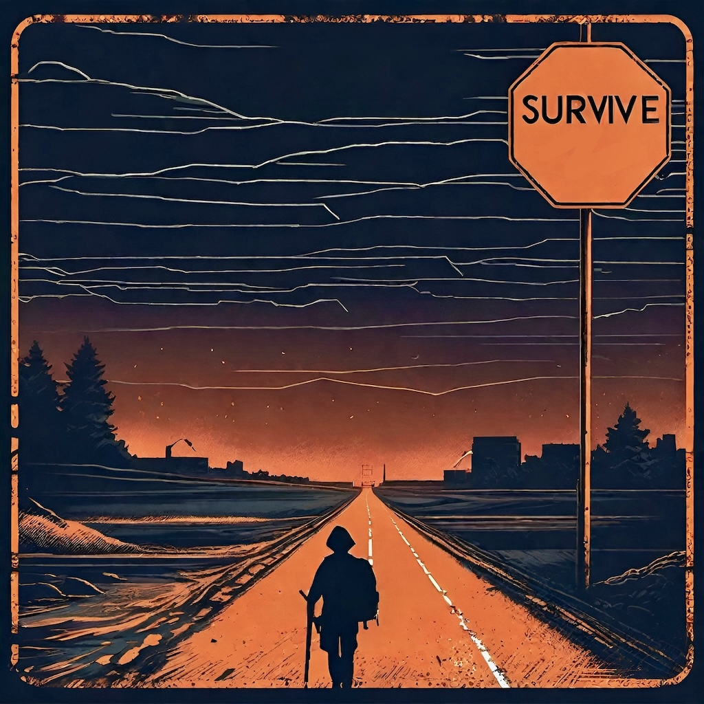

<div align="center">
  

  # Survive

  **A choice-driven zombie-apocalypse story for iPhone and iPad**

  Built with SwiftUI as a first iOS development project.
</div>

> [!IMPORTANT]
> **This project is archived.** Survive is no longer under active development, and no new features, releases, compatibility updates, or support are planned. The repository remains available as a historical snapshot and learning reference. Issues and pull requests may not be reviewed.

## About

Survive is a short, text-based role-playing game in which each decision changes the player's route through the opening hours of a zombie outbreak. The story combines long-form narrative, comic-style scene artwork, and branching choices as the player attempts to reach an evacuation center.

The current version contains 17 chapters. Choices lead through different scenes, but every route ultimately converges on the same ending and final epilogue.

## Screenshots

<div align="center">
  
  &nbsp;&nbsp;
  
</div>

## Features

- Branching, choice-driven story progression across 17 chapters
- Bundled comic-style artwork for key story scenes
- A single completed ending with a concluding epilogue
- Adjustable text size from 15 to 35 points
- Persistent font-size preference using `AppStorage`
- Native SwiftUI interface for iPhone and iPad
- No third-party packages, accounts, network services, or backend
- A separate static showcase site included in the repository

## Requirements

- A Mac with Xcode 15.2 or newer
- An iPhone or iPad running iOS/iPadOS 17.2 or newer, or a compatible simulator
- Git, if cloning from the command line

The Xcode project targets iOS 17.2, uses Swift 5 language mode, and has no external package dependencies.

## Build and Run

1. Clone the repository:

   ```sh
   git clone https://github.com/Great-Visions-Code/Survive.git
   cd Survive
   ```

2. Open `Survive.xcodeproj` in Xcode.
3. Select the `Survive` scheme.
4. Choose an iPhone or iPad simulator running iOS 17.2 or newer.
5. Press **Run**.

The project builds for the simulator without code signing. To run it on a physical device, select your own development team under **Signing & Capabilities**. You may also need to replace the existing `com.GVDev.Survive` bundle identifier with one registered to your team.

No prebuilt app or App Store release is included.

## How to Play

1. Launch the app and select **Click Here to Start**.
2. Select **Start Story** to begin with Chapter 1.
3. Read each chapter and choose one of the highlighted actions.
4. Continue until you reach the evacuation center and final epilogue.
5. Use **Return to Main Menu** to start again and explore another route.

The gear button on the welcome screen opens the text-size setting. Changes are saved locally between launches.

## Project Structure

```text
Survive/
├── Survive.xcodeproj/          # Xcode project
├── Survive/
│   ├── Survive.swift           # Application entry point
│   ├── Models/
│   │   ├── ChapterModel.swift
│   │   └── StoryDataModel.swift
│   ├── ViewModels/
│   │   └── StoryProgressionViewModel.swift
│   ├── Views/                  # SwiftUI screens and shared UI
│   └── Assets.xcassets/        # App icon and story artwork
├── Pictures/                   # README screenshots and artwork
├── index.html                  # Static project showcase
├── assets/ and images/         # Showcase site resources
└── LICENSE
```

The app follows a small MVVM structure:

- `Chapter` and `StoryDataModel.swift` define the chapter content and choice graph.
- `StoryProgressionViewModel` owns the current chapter and resolves each selected destination.
- SwiftUI views render the current state, present choices, and manage navigation.

## Static Showcase

The repository also contains a standalone promotional website. Open `index.html` in a browser, or serve the repository root with any static web server, to view it. The site does not need a build step or package installation.

## Known Limitations

- All branches currently converge on one ending.
- Progress is not saved; there are no save slots or checkpoints.
- Story text and artwork are bundled with the app and cannot be downloaded or edited in-app.
- The project does not include an automated test target.
- Compatibility with future iOS and Xcode releases is not being maintained.

## Background and Credits

Survive was created by Great-Visions-Code Software by Gustavo Vazquez in 2024 as a first Swift and SwiftUI project. It was inspired by branching storybooks and built to explore SwiftUI navigation, observable state, reusable views, and data-driven storytelling.

The comic-style story artwork was created with generative AI. The static showcase uses a design by [HTML5 UP](https://html5up.net/).

## License

Survive is available under the [MIT License](LICENSE).
